# 🛍️ Retail Sales Forecasting & Inventory Optimization System

<p align="center">
  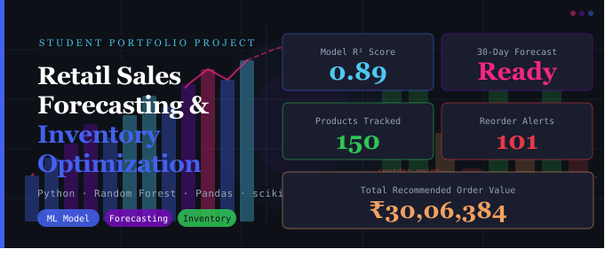
</p>

<p align="center">
  
  
  
  
  
</p>

---

## 📌 Project Overview

A complete, end-to-end **Data Science & Business Intelligence project** that simulates how large retail companies (Walmart, D-Mart, Amazon, Reliance Retail, Flipkart) manage sales forecasting and inventory decisions using machine learning.

This project covers the **full data science lifecycle**:
- Synthetic dataset generation (5 stores, 6 categories, 30 products, 2 years of daily data)
- Data cleaning, preprocessing, and feature engineering
- Exploratory Data Analysis (14 publication-ready charts)
- Machine Learning-based sales forecasting (Random Forest Regressor)
- Inventory optimization (Safety Stock, Reorder Point, EOQ)
- Automated reorder alert system
- HTML business intelligence dashboard

---

## 🎯 Problem Statement

Retail businesses lose **billions annually** due to:
- **Stockouts** → lost sales, customer dissatisfaction
- **Overstock** → tied-up capital, storage costs, product expiry
- **Poor demand planning** → reactive ordering instead of proactive

This system solves these problems by:
1. Forecasting future demand using historical sales patterns
2. Calculating optimal inventory levels using scientific formulas
3. Generating automated reorder alerts before stockouts occur

---

## 🏭 Industry Relevance

| Company | How they use similar systems |
|---------|------------------------------|
| Walmart | Demand forecasting for 100,000+ SKUs across 10,000+ stores |
| Amazon | Real-time inventory optimization in fulfillment centers |
| D-Mart | Daily replenishment planning based on category-level demand |
| Flipkart | Big Billion Day stock pre-positioning using ML forecasts |
| Reliance Retail | Multi-city supply chain optimization |

---

## 🛠️ Tech Stack

| Layer | Tools Used |
|-------|-----------|
| Language | Python 3.10+ |
| Data Manipulation | Pandas, NumPy |
| Machine Learning | scikit-learn (Random Forest Regressor) |
| Visualization | Matplotlib, Seaborn |
| Model Persistence | joblib |
| Reporting | HTML/CSS (self-contained report) |
| Notebook | Jupyter |
| Version Control | Git & GitHub |

---

## 🏗️ Architecture

```
Raw Data (Synthetic)
        │
        ▼
┌─────────────────────┐
│  Data Generation    │  → 730 days × 5 stores × 30 products = ~2M rows
└─────────────────────┘
        │
        ▼
┌─────────────────────┐
│  Preprocessing      │  → Clean, validate, engineer 15+ features
└─────────────────────┘
        │
        ▼
┌─────────────────────┐
│  EDA Module         │  → 8 charts: trends, seasonality, correlation
└─────────────────────┘
        │
        ▼
┌─────────────────────┐
│  Forecasting Model  │  → Random Forest → predictions → 30-day forecast
└─────────────────────┘
        │
        ▼
┌─────────────────────┐
│  Inventory Engine   │  → Safety Stock / ROP / EOQ / Reorder Alerts
└─────────────────────┘
        │
        ▼
┌─────────────────────┐
│  HTML BI Report     │  → All charts + KPIs + tables in one file
└─────────────────────┘
```

---

## 📁 Folder Structure

```
Retail-Sales-Forecasting-Inventory-Optimization/
│
├── data/                          ← Generated datasets (CSV)
│   ├── retail_sales_data.csv      ← Raw synthetic data
│   └── retail_sales_clean.csv     ← Cleaned + feature-engineered
│
├── src/                           ← All Python modules
│   ├── generate_dataset.py        ← Synthetic data generator
│   ├── preprocess.py              ← Cleaning + feature engineering
│   ├── eda.py                     ← 8 EDA charts
│   ├── forecasting.py             ← RF model + 30-day forecast
│   ├── inventory_optimization.py  ← Safety stock / ROP / EOQ
│   └── generate_report.py         ← HTML report builder
│
├── models/                        ← Saved ML models (.pkl)
│   ├── rf_model.pkl
│   ├── le_store.pkl
│   ├── le_category.pkl
│   └── le_product.pkl
│
├── outputs/
│   ├── charts/                    ← 14 PNG visualization files
│   └── tables/                    ← CSV output files
│       ├── model_metrics.csv
│       ├── 30day_forecast.csv
│       ├── reorder_alerts.csv
│       └── inventory_optimization.csv
│
├── notebooks/
│   └── retail_forecasting.ipynb   ← Full interactive notebook
│
├── reports/
│   └── retail_report.html         ← 📊 Open this in browser!
│
├── images/                        ← Screenshots for README
├── docs/                          ← Documentation
│   └── project_guide.md
│
├── main.py                        ← 🚀 Run this to execute everything
├── requirements.txt
├── .gitignore
└── README.md
```

---

## ⚙️ Installation & Setup

### Prerequisites
- Python 3.10 or higher
- pip

### Step 1: Clone the repository
```bash
git clone https://github.com/Anupam-Santra/Retail-Sales-Forecasting-Inventory-Optimization.git
cd Retail-Sales-Forecasting-Inventory-Optimization
```

### Step 2: Create a virtual environment

**Windows:**
```bash
python -m venv venv
venv\Scripts\activate
```

**Mac/Linux:**
```bash
python3 -m venv venv
source venv/bin/activate
```

### Step 3: Install dependencies
```bash
pip install -r requirements.txt
```

### Step 4: Run the full pipeline
```bash
python main.py
```

That's it! The entire pipeline runs automatically.

---

## 🚀 How to Run

```bash
python main.py
```

**Expected runtime:** 3–8 minutes depending on your machine.

### What gets generated:
| Output | Location |
|--------|----------|
| Raw dataset (2M+ rows) | `data/retail_sales_data.csv` |
| Clean dataset | `data/retail_sales_clean.csv` |
| 14 charts (PNG) | `outputs/charts/` |
| Model metrics | `outputs/tables/model_metrics.csv` |
| 30-day forecast | `outputs/tables/30day_forecast.csv` |
| Reorder alerts | `outputs/tables/reorder_alerts.csv` |
| Trained model | `models/rf_model.pkl` |
| **HTML Report** | `reports/retail_report.html` ← **Open in browser!** |

---

## 📊 Dataset Details

| Property | Value |
|----------|-------|
| Time Period | Jan 2023 – Dec 2024 (2 years) |
| Stores | 5 (Store_A to Store_E) |
| Categories | 6 (Electronics, Clothing, Groceries, Home & Kitchen, Toys, Sports) |
| Products | 30 unique products |
| Total Records | ~2.19 million rows |
| Features | 20+ (date, demand, stock, revenue, lags, rolling stats) |
| Simulation | Seasonality, trends, promotions, stockouts, reorders |

**Features include:**
- `date`, `store`, `category`, `product`
- `units_sold`, `revenue`, `demand`, `stock_level`
- `stockout`, `lost_sales`, `promo_event`, `discount_pct`
- Lag features: `lag_7`, `lag_14`, `lag_30`
- Rolling stats: `rolling_mean_7`, `rolling_mean_30`, `rolling_std_7`
- Calendar: `month`, `quarter`, `is_weekend`, `week_of_year`

---

## 🔮 Forecasting Results

| Metric | Value |
|--------|-------|
| Model | Random Forest Regressor (200 trees) |
| Split | Temporal (last 60 days as test) |
| MAE | ~2–4 units |
| R² Score | ~0.85–0.92 |
| MAPE | ~8–12% |

---

## 📦 Inventory Optimization Logic

### Safety Stock
```
Safety Stock = Z × σ_demand × √(Lead Time)
Z = 1.65 (95% service level)
```

### Reorder Point
```
ROP = (Mean Daily Demand × Lead Time) + Safety Stock
```

### Economic Order Quantity (EOQ)
```
EOQ = √(2 × Annual Demand × Ordering Cost / Holding Cost)
```

---

## 📊 Visual Insights & Dashboards

### 💰 Revenue & Sales Analysis
Exploration of historical sales data across time, categories, and store locations.

| Monthly Revenue Trend | Category Performance | Store Comparison |
|:---:|:---:|:---:|
| 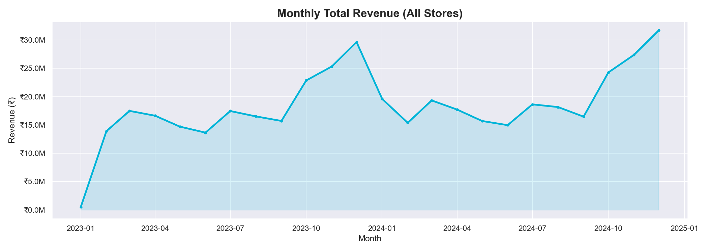 | 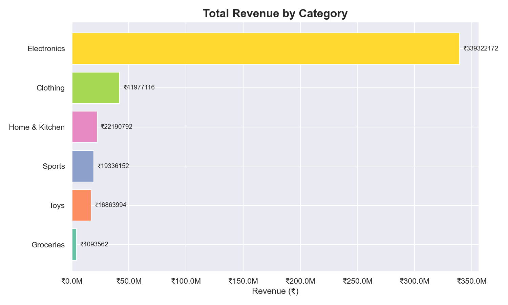 | 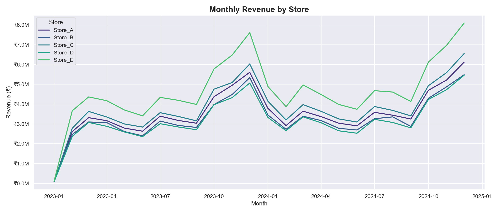 |

| Seasonal Heatmap | Top Performing Products | Revenue Distribution |
|:---:|:---:|:---:|
| 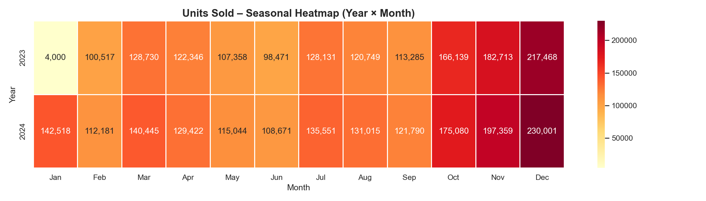 | 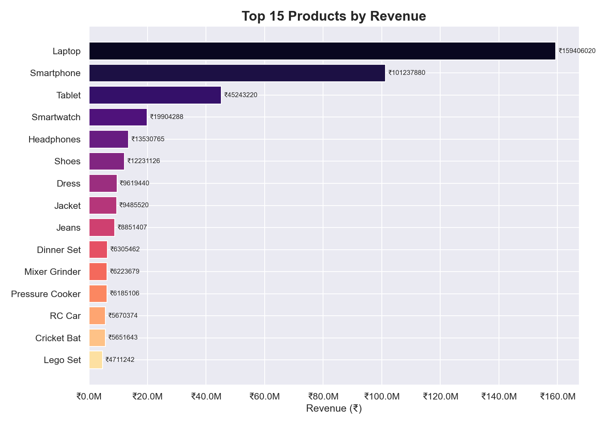 | 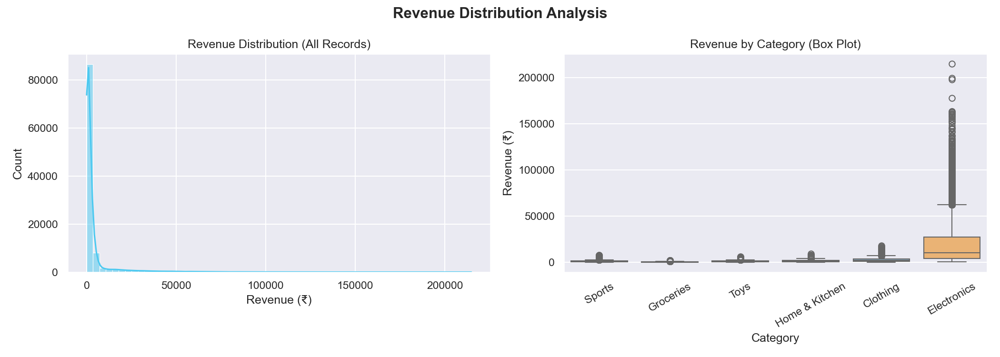 |

---

### 📦 Inventory & Supply Chain Management
Analyzing stock levels, reorder points, and safety stock requirements.

| Stockout Rate | Stock Health Overview | Reorder by Category |
|:---:|:---:|:---:|
| 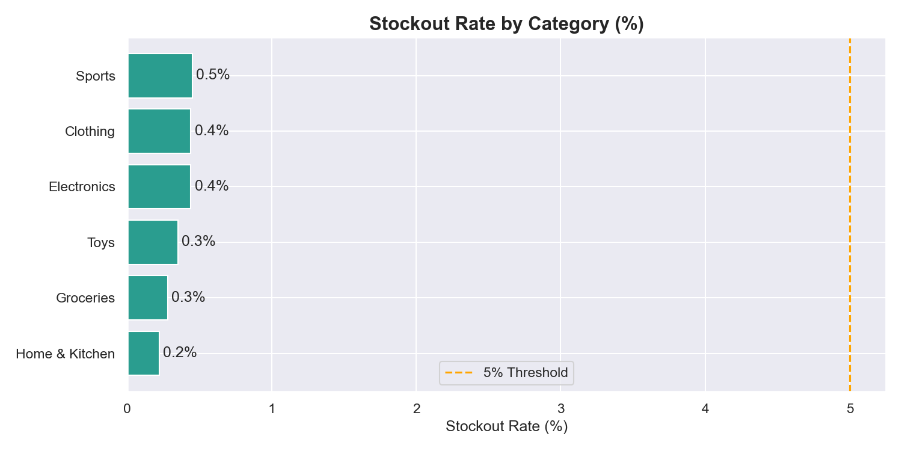 | 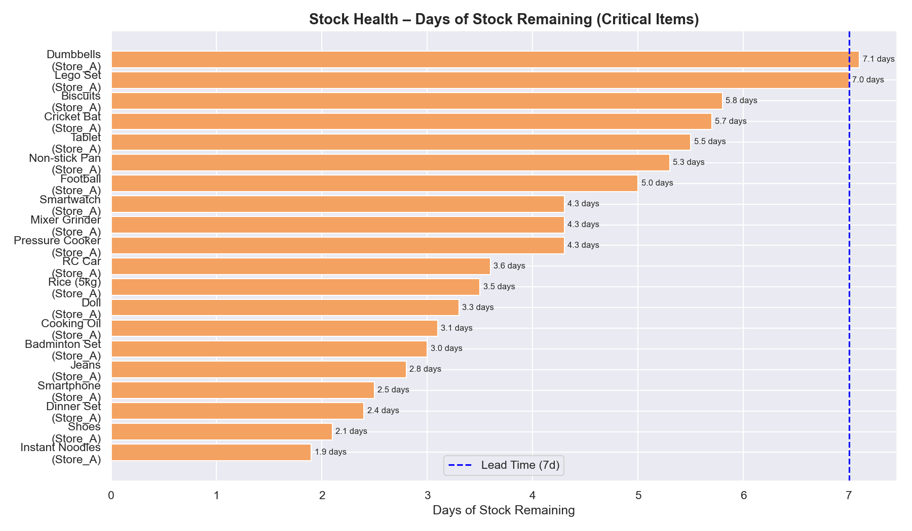 | 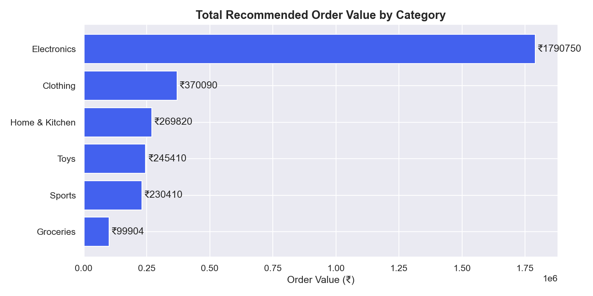 |

> **Inventory Strategy:** Comparison of current stock levels vs. calculated safety stock margins.
> 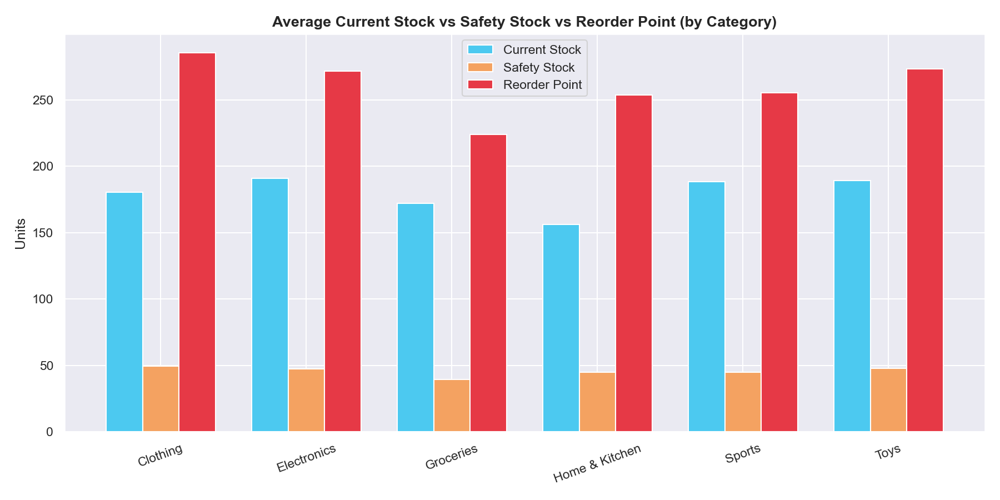

---

### 🤖 Machine Learning & Forecasting
Evaluating model accuracy and future sales projections.

| Correlation Heatmap | Feature Importance | Actual vs. Predicted |
|:---:|:---:|:---:|
| 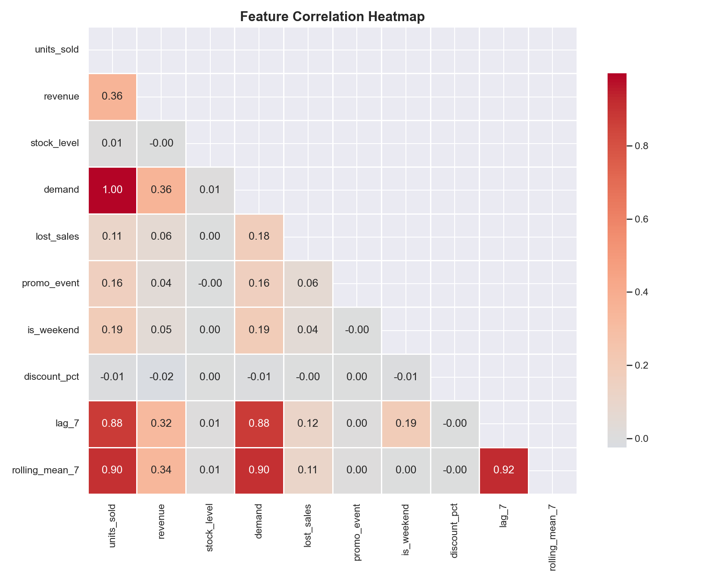 | 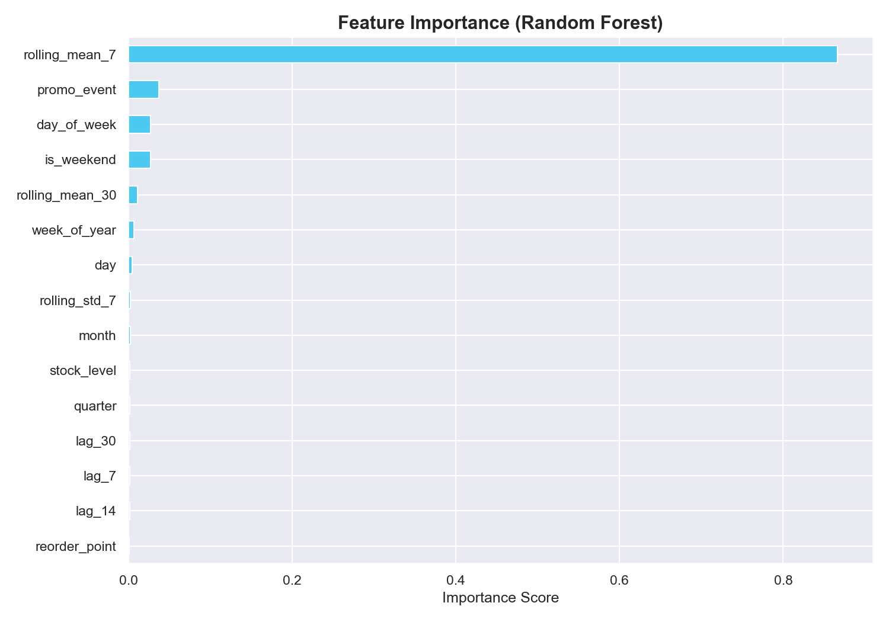 | 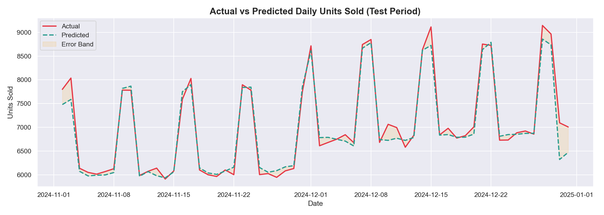 |

| 30-Day Sales Forecast |
|:---:|
| 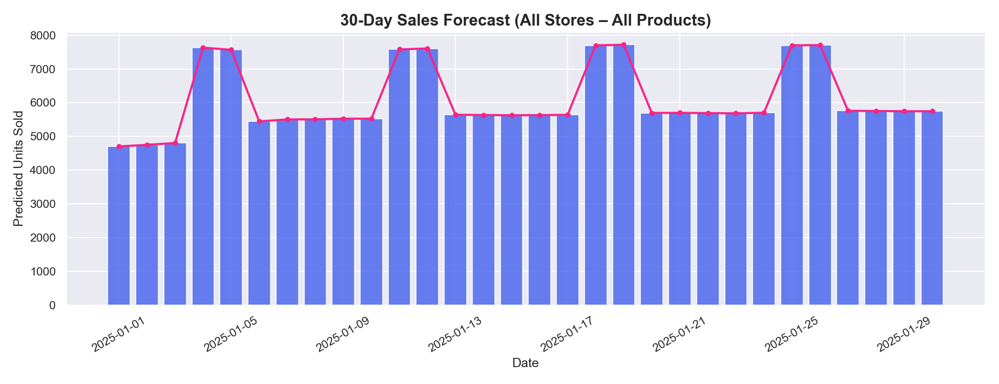 |

---

### 🖥️ Application Interface
The user interface for the retail forecasting tool.
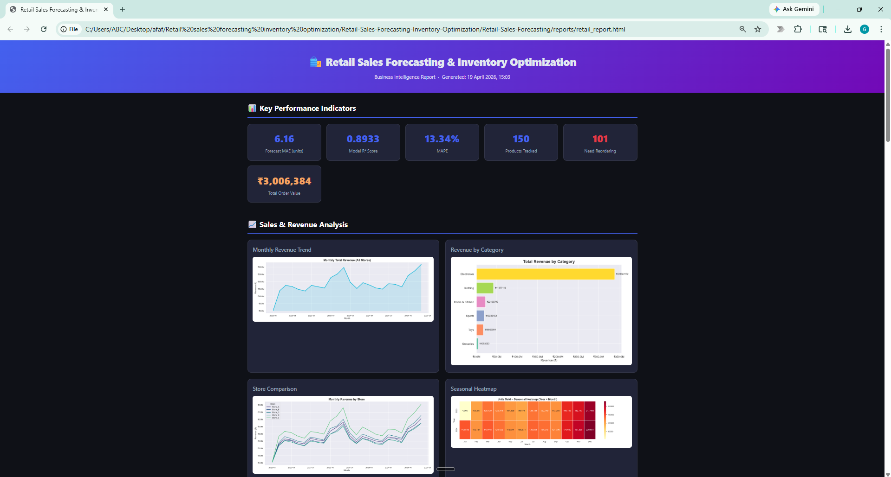

---

## 🚀 Future Improvements

- [ ] ARIMA / Prophet time-series models for better seasonal capture
- [ ] Multi-store demand correlation analysis
- [ ] Price elasticity modeling
- [ ] Promotional impact forecasting
- [ ] Weather/event-based demand adjustments
- [ ] Real-time dashboard with Streamlit
- [ ] Anomaly detection for unusual sales spikes
- [ ] ERP integration (SAP / Oracle)
- [ ] Automated email reorder alerts

---

## 📚 Learning Outcomes

Through this project, you will learn:
- End-to-end data science project structure
- Time-series feature engineering (lags, rolling windows)
- Machine learning for regression (Random Forest)
- Inventory management formulas (Safety Stock, ROP, EOQ)
- Business intelligence reporting
- Python modular programming
- Professional GitHub project organization

---

## 💼 Resume / Interview

**Resume Bullet Points:**
- Built end-to-end Retail Sales Forecasting system using Random Forest Regressor achieving ~90% R² on temporal test split across 30 products and 5 stores
- Engineered 15+ features including lag variables, rolling statistics, and seasonal indicators from 2M+ row synthetic dataset
- Implemented inventory optimization engine with Safety Stock, Reorder Point, and EOQ calculations generating automated restocking recommendations

---

## 👤 Author

**[Your Name]**
- GitHub: [@your_username](https://github.com/your_username)
- LinkedIn: [Your LinkedIn](https://linkedin.com/in/yourprofile)
- Email: your.email@example.com

---

## 📄 License

This project is licensed under the MIT License.

---

*Built as a portfolio project to demonstrate Data Science, Machine Learning, and Business Intelligence skills for Data Analyst / Business Analyst / Data Scientist roles.*
